Задание 1
================
Ирина Ангелова
21.10.2022

# ***Загрузим библиотеки***

``` r
# Если у вас не установлены какие-то из библиотек ниже, то установить их можно следующей командой. Эти библиотеки пригодятся нам во время занятия, но подгружать в library() мы их будем тогда, когда будем затрагивать соответствующую тему.
# install.packages(c('dplyr', 'ggplot2')

library(dplyr)
library(ggplot2)
library(ggpubr)
```

# ***1 Задача***

Загрузим данные для работы

Датасет insurance_cost.csv. age: возраст основного бенефициара sex:
страховой подрядчик пол, женский, мужской bmi: индекс массы тела,
обеспечивающий представление о теле, вес, который относительно высок или
низок по отношению к росту, объективный индекс массы тела (кг/м^2) с
использованием отношения роста к весу, в идеале 18,5 до 24,9 children:
количество детей, охваченных медицинской страховкой / Количество
иждивенцев smoker: курение region: район проживания получателя в США,
северо-восток, юго-восток, юго-запад, северо-запад. charges:
индивидуальные медицинские расходы, оплачиваемые медицинским
страхованием

``` r
ins <- read.csv('/Users/irina_angelova/Desktop/1___Институт_биоинфы/визуализация_данных/1_дз/Visualisation_task_1/insurance_cost.csv', stringsAsFactors = T)
head(ins)
```

    ##   age    sex    bmi children smoker    region   charges
    ## 1  19 female 27.900        0    yes southwest 16884.924
    ## 2  18   male 33.770        1     no southeast  1725.552
    ## 3  28   male 33.000        3     no southeast  4449.462
    ## 4  33   male 22.705        0     no northwest 21984.471
    ## 5  32   male 28.880        0     no northwest  3866.855
    ## 6  31 female 25.740        0     no southeast  3756.622

``` r
str(ins)
```

    ## 'data.frame':    1338 obs. of  7 variables:
    ##  $ age     : int  19 18 28 33 32 31 46 37 37 60 ...
    ##  $ sex     : Factor w/ 2 levels "female","male": 1 2 2 2 2 1 1 1 2 1 ...
    ##  $ bmi     : num  27.9 33.8 33 22.7 28.9 ...
    ##  $ children: int  0 1 3 0 0 0 1 3 2 0 ...
    ##  $ smoker  : Factor w/ 2 levels "no","yes": 2 1 1 1 1 1 1 1 1 1 ...
    ##  $ region  : Factor w/ 4 levels "northeast","northwest",..: 4 3 3 2 2 3 3 2 1 2 ...
    ##  $ charges : num  16885 1726 4449 21984 3867 ...

``` r
summary(ins)
```

    ##       age            sex           bmi           children     smoker    
    ##  Min.   :18.00   female:662   Min.   :15.96   Min.   :0.000   no :1064  
    ##  1st Qu.:27.00   male  :676   1st Qu.:26.30   1st Qu.:0.000   yes: 274  
    ##  Median :39.00                Median :30.40   Median :1.000             
    ##  Mean   :39.21                Mean   :30.66   Mean   :1.095             
    ##  3rd Qu.:51.00                3rd Qu.:34.69   3rd Qu.:2.000             
    ##  Max.   :64.00                Max.   :53.13   Max.   :5.000             
    ##        region       charges     
    ##  northeast:324   Min.   : 1122  
    ##  northwest:325   1st Qu.: 4740  
    ##  southeast:364   Median : 9382  
    ##  southwest:325   Mean   :13270  
    ##                  3rd Qu.:16640  
    ##                  Max.   :63770

# ***2 Задача***

Гистограммы всех нумерических переменных.

``` r
bar_1 <- ggplot(data = ins, 
                aes(x = age)) +
  geom_histogram(color="blue3", fill="white")
bar_2 <- ggplot(data = ins, 
                aes(x = children)) +
  geom_histogram(color="firebrick3", fill="white")
bar_3 <- ggplot(data = ins, 
                aes(x = bmi)) +
  geom_histogram(color="cyan4", fill="white")
bar_4 <- ggplot(data = ins, 
                aes(x = charges)) +
  geom_histogram(color="purple", fill="white")

combine_plot <- ggarrange(bar_1, bar_2, bar_3, bar_4,
                          ncol = 2, nrow = 2) 
```

    ## `stat_bin()` using `bins = 30`. Pick better value with `binwidth`.
    ## `stat_bin()` using `bins = 30`. Pick better value with `binwidth`.
    ## `stat_bin()` using `bins = 30`. Pick better value with `binwidth`.
    ## `stat_bin()` using `bins = 30`. Pick better value with `binwidth`.

``` r
combine_plot
```

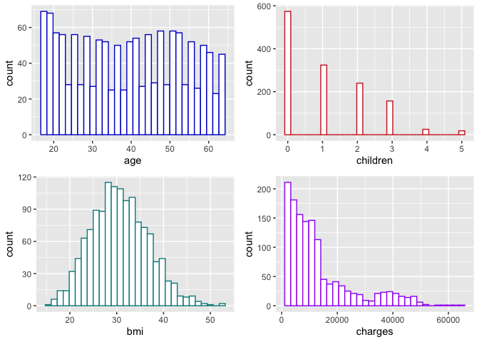<!-- -->

# ***3 Задача***

Нарисуйте график плотности по колонке charges. Отметьте вертикальные
линии средней и медианы на графике. Раскрасьте текст и линии средней и
медианы разными цветами. Добавьте текстовые пояснения значения средней и
медианы. Подберите тему для графика. Назовите оси.

``` r
charges_mean <- round(mean(ins$charges),2)
charges_median <- round(median(ins$charges),2)

pp <- ggplot(data = ins, 
       aes(x = charges)) +
  geom_density(color="cyan3") +
  geom_vline(aes(xintercept = charges_mean), colour = "mediumorchid") +
  geom_vline(aes(xintercept = charges_median), colour = "coral1") +
  ggtitle('Frequency of individual medical costs billed by health insurance') +
  labs(y = 'Frequency', x = 'Charges') +
  annotate("text", 
           x = charges_mean+3000, 
           y = 0.00002, 
           label=paste0("Mean=", charges_mean),
           colour = "mediumorchid",
           size=3,
           angle=90) +
  annotate("text", 
           x = charges_median-3000, 
           y = 0.00002, 
           label=paste0("Median=", charges_median),
           colour = "coral1",
           size=3,
           angle=90) +
  theme_minimal() +
  theme(
    title = element_text(size = 10), 
    axis.title.y = element_text(size=6),
    axis.text = element_text(size = 6)) 
pp
```

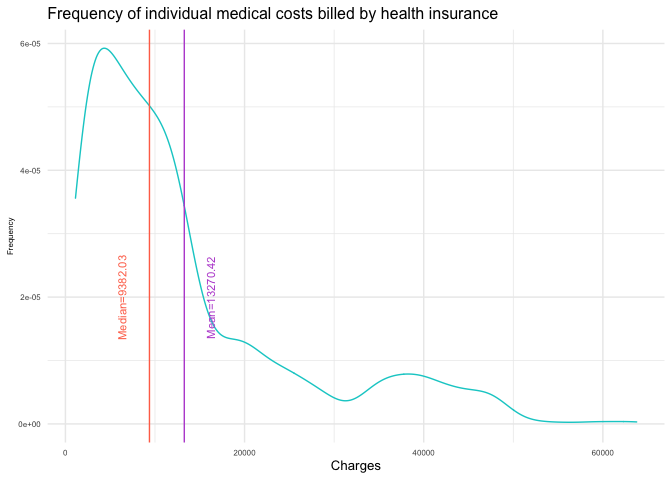<!-- -->

# ***4 Задача***

Сделайте три box_plot по отношению переменных charges и (1) sex (2)
smoker (3) region. Подберите тему для графика. Назовите оси.

``` r
box_1 <- ggplot() +
  geom_boxplot(data = ins, 
               aes(x = charges, y = sex, fill = sex)) +
  theme_minimal() +
  ggtitle('Распределение сборов относительно мужчин и женщин') + 
  labs(y = 'Пол', x = 'Сборы') +
  theme(
    title = element_text(size = 5), 
    axis.title.y = element_text(size=6),
    axis.text = element_text(size = 6)) +
  coord_flip() 

box_2 <- ggplot() +
  geom_boxplot(data = ins, 
               aes(x = charges, y = smoker, fill = smoker)) +
  theme_minimal() +
  ggtitle('Распределение сборов относительно курящих и не курящих') + 
  labs(y = 'Курение', x = 'Сборы') +
  theme(
    title = element_text(size = 5), 
    axis.title.y = element_text(size=6),
    axis.text = element_text(size = 6)) +
  coord_flip() 

box_3 <- ggplot() +
  geom_boxplot(data = ins, 
               aes(x = charges, y = region, fill = region)) +
  theme_minimal() +
  ggtitle('Распределение сборов относительно региона') + 
  labs(y = 'Регион', x = 'Сборы') +
  theme(
    title = element_text(size = 5), 
    axis.title.y = element_text(size=6),
    axis.text = element_text(size = 6)) +
  coord_flip() 

combine_plot <- ggarrange(box_1, box_2, box_3,
                          ncol = 2, nrow = 2) 
combine_plot
```

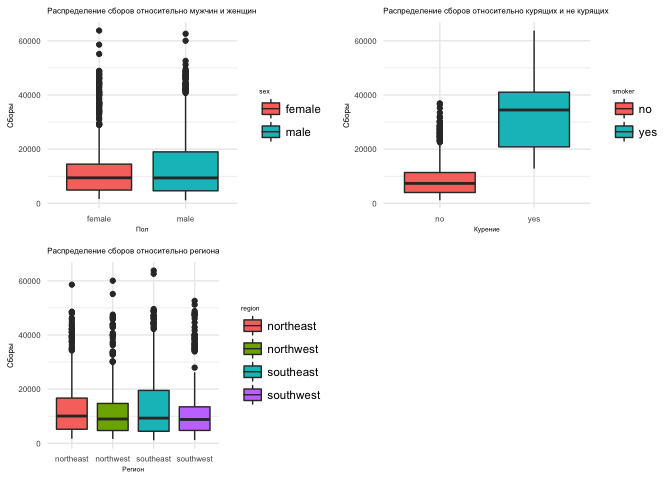<!-- -->

# ***5 Задача***

Объедините графики из заданий 3 и 4 в один так, чтобы сверху шёл один
график из задания 3, а под ним 3 графика из задания 4. Сделайте общее
название для графика.

``` r
combine_plot_2 <- ggarrange(pp, ggarrange(box_1, box_2, box_3,
                                        ncol = 3, nrow = 1) ,
                          ncol = 1, nrow = 2) 
combine_plot_2
```

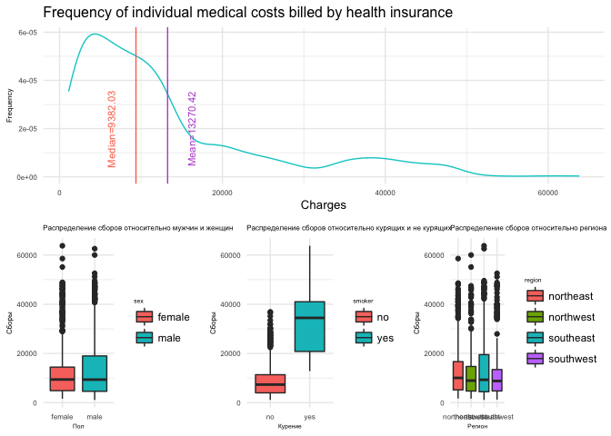<!-- -->

# ***6 Задача***

Сделайте фасет графика из задания 3 по колонке region.

``` r
pp +
  facet_grid(. ~ region)
```

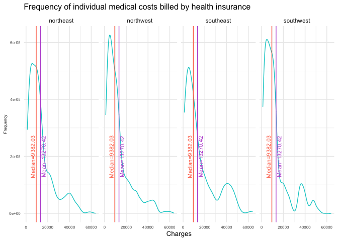<!-- -->

# ***7 Задача***

Постройте scatter plot отношения переменных age и charges. Добавьте
названия осей, название графика и тему. Сделайте так, чтобы числа по оси
Х отображались 14 шрифтом.

``` r
age_charg <- ggplot(data = ins, aes(x=age, y=charges)) +
  geom_point(size=2, alpha = 1/2) + 
  ggtitle('График зависимости сборов от возраста') + 
  labs(y = 'Сборы', x = 'Возраст') +
  theme(axis.text.x = element_text(size = 14))
age_charg
```

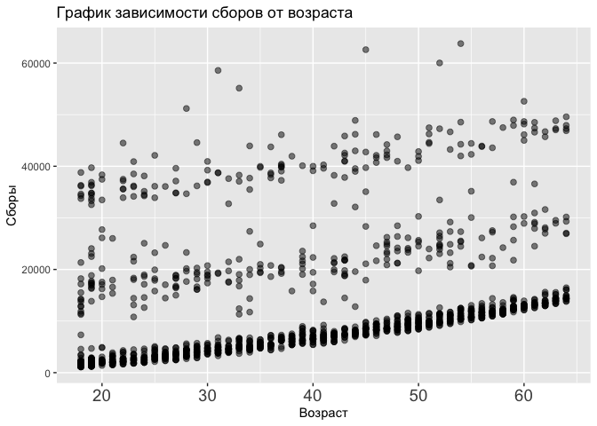<!-- -->

# ***8 Задача***

Проведите линию тренда для предыдущего графика.

``` r
age_charg +
  geom_smooth(method=lm, se=TRUE, color="red")
```

    ## `geom_smooth()` using formula 'y ~ x'

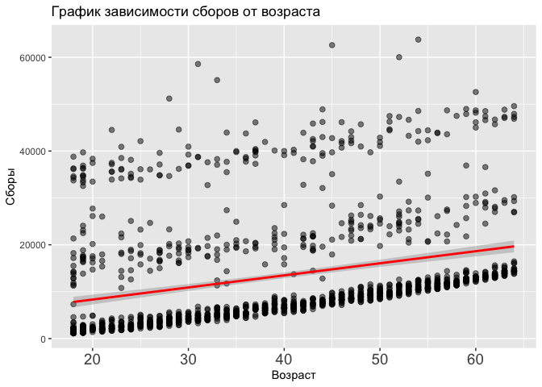<!-- -->

# ***9 Задача***

Сделайте разбивку предыдущего графика по колонке smokers (у вас должно
получится две линии тренда для курящих и нет).

``` r
age_charg_2 <- ggplot(data = ins, aes(x=age, y=charges, 
                                      color=smoker, 
                                      fill = smoker,
                                      group = smoker)) +
  geom_point(size=1.5, colour = 'black', alpha = 1/2) + 
  ggtitle('График зависимости сборов от возраста') + 
  labs(y = 'Сборы', x = 'Возраст') +
  theme(axis.text.x = element_text(size = 14))+
  geom_smooth(method=lm, se=TRUE, alpha = 0.2)
age_charg_2
```

    ## `geom_smooth()` using formula 'y ~ x'

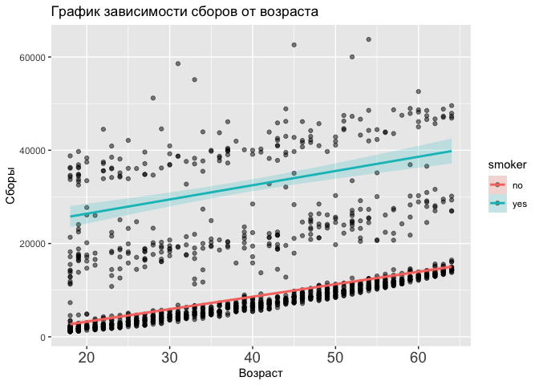<!-- -->

``` r
age_charg_3 <- ggplot(data = ins, aes(x=age, y=charges, 
                                      color=smoker, 
                                      fill = smoker,
                                      group = smoker)) +
  geom_point(size=1.5, alpha = 1/2) + 
  ggtitle('График зависимости сборов от возраста') + 
  labs(y = 'Сборы', x = 'Возраст') +
  theme(axis.text.x = element_text(size = 14))+
  geom_smooth(method=lm, se=TRUE, alpha = 0.2)
age_charg_3
```

    ## `geom_smooth()` using formula 'y ~ x'

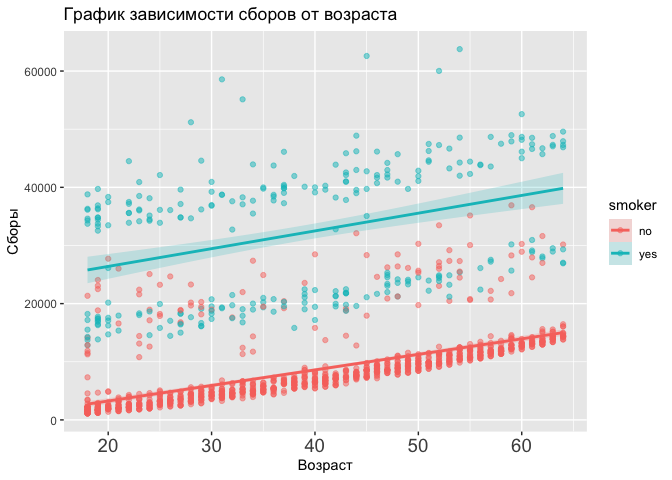<!-- -->

# ***10 Задача***

Сделайте график из заданий 7-9, но вместо переменной age используйте
переменную bmi.

``` r
age_bmi_2 <- ggplot(data = ins, aes(x=age, y=bmi, 
                                      color=smoker, 
                                      fill = smoker,
                                      group = smoker)) +
  geom_point(size=1.5, colour = 'black', alpha = 1/2) + 
  ggtitle('График зависимости сборов от индекс массы тела') + 
  labs(y = 'Индекс массы тела', x = 'Возраст') +
  theme(axis.text.x = element_text(size = 14))+
  geom_smooth(method=lm, se=TRUE, alpha = 0.2)
age_bmi_2
```

    ## `geom_smooth()` using formula 'y ~ x'

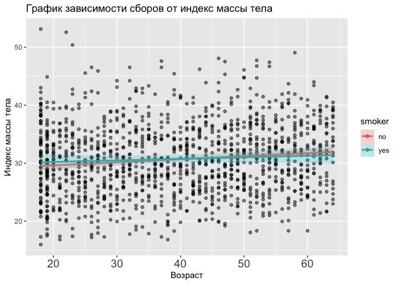<!-- -->

``` r
age_bmi_3 <- ggplot(data = ins, aes(x=age, y=bmi, 
                                      color=smoker, 
                                      fill = smoker,
                                      group = smoker)) +
  geom_point(size=1.5, alpha = 1/2) + 
  ggtitle('График зависимости сборов от индекс массы тела') + 
  labs(y = 'Индекс массы тела', x = 'Возраст') +
  theme(axis.text.x = element_text(size = 14))+
  geom_smooth(method=lm, se=TRUE, alpha = 0.2)
age_bmi_3
```

    ## `geom_smooth()` using formula 'y ~ x'

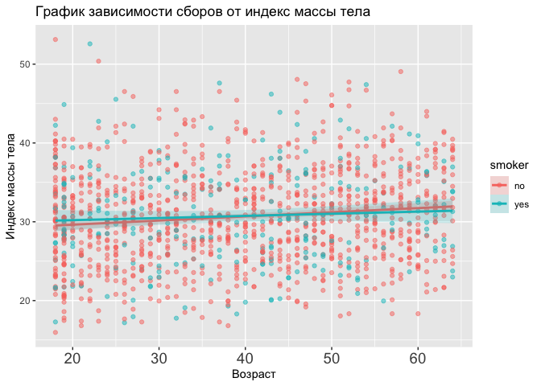<!-- -->

# ***14 Задача***

Приблизить график из задания

``` r
ins <- ins %>% 
  mutate(
    age_group = case_when(
      age < 35 ~ "age: 21-34",
      age >= 35 & age < 50 ~ "age:35-49",
      age >= 50 ~ "age:50+"
    ))

ins %>% 
  ggplot(aes(x=bmi, y=log(charges), 
             fill = age_group, 
             color = age_group,
             group = age_group)) + 
  geom_point(colour = 'darkslateblue', alpha = 1/2) +
  facet_grid(. ~ age_group) + 
  theme_minimal() +
  ggtitle('Отношение индекса массы тела к логарифму трат по возрастным группам') +
  #geom_smooth(method=lm, se=TRUE, color=age_group, fill="black") + 
  geom_smooth(method=lm) +
  theme(text=element_text(size=10)) +
  theme(legend.position="bottom")
```

    ## `geom_smooth()` using formula 'y ~ x'

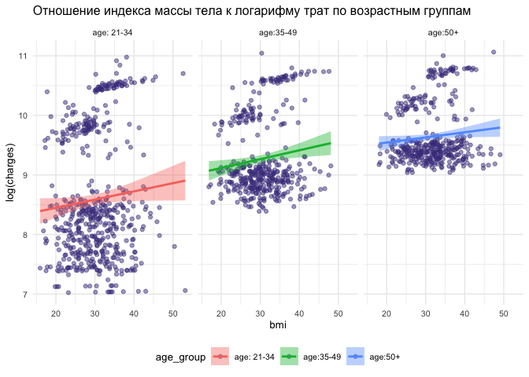<!-- -->
